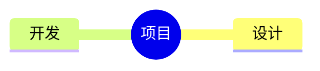

# v1.6.0 Mermaid 图表渲染 Spec

日期：2026-07-23

## 目标

- 将语言标记为 `mermaid` 的围栏代码块渲染为 SVG，并显示在预览区对应位置。
- 支持锁定 Mermaid 版本内置的全部图表类型，不在应用层维护图表类型白名单。
- 保持扩展完全离线运行，并符合 Manifest V3 的本地脚本限制。
- 避免图表渲染拖慢普通 Markdown、多标签页和持续输入场景。
- HTML 导出直接内联已生成的 SVG，不依赖 Mermaid 运行时。

## 语法

````markdown

````

围栏标记 `mermaid` 不区分大小写，后续图表类型由 Mermaid 根据源码自行识别。

## 功能范围

- 支持 Mermaid 11.16.0 内置的稳定和实验性图表类型。
- 普通代码围栏继续由 highlight.js 处理。
- 未知类型、空图表和语法错误只影响当前图表块。
- 成功时隐藏 Mermaid 源码；失败时显示错误状态和原始源码。
- 图表字体随应用五档字号重新渲染。
- 宽图在容器内保留可读宽度并横向滚动，不导致页面整体溢出。

## 渲染管线

1. markdown-it 将 Mermaid 围栏转换为安全占位节点和隐藏源码。
2. DOMPurify 先净化普通 Markdown HTML，再写入预览区。
3. Mermaid 控制器按需加载本地 ESM 入口和图表分块。
4. Mermaid 逐图生成 SVG，返回结果再次经过 DOMPurify 的 SVG 配置。
5. 控制器检查预览修订号，只有当前文档结果可以写回。

## 性能

- 不含 Mermaid 围栏的文档不加载 Mermaid 运行库。
- 首次打开文件立即渲染；持续编辑时额外等待 450ms。
- 图表串行渲染，避免 Mermaid 临时 DOM 和配置互相干扰。
- SVG 缓存按图表源码、位置和字号区分，最多保留 24 项或约 4 MiB。
- 页面位于后台时沿用现有暂停渲染机制。
- 预览区关闭时推迟图表渲染，恢复预览时再立即处理。

## 安全

- `securityLevel` 固定为 `strict`，不允许文档覆盖。
- 禁用 HTML labels 和节点点击脚本。
- 单篇文档最多渲染 50 个图表。
- 单个图表最多 50000 个字符、500 条边。
- 单个图表超过 12 秒即停止等待并显示源码回退。
- 远程图片、远程样式及 SVG 非片段资源引用会被拒绝或移除。
- Mermaid 返回 SVG 必须二次净化后才能进入预览区。
- 扩展不加载 CDN、远程图标包或第三方 Mermaid 插件。

## HTML 导出

- 导出前等待当前 Mermaid 渲染批次完成。
- 成功图表只导出 SVG，不携带隐藏源码或 Mermaid 运行库。
- 失败图表保留错误说明和源码。
- 导出文件包含图表响应式与横向滚动样式。

## 验收标准

- 思维导图、流程图、时序图、类图、状态图、ER 图等代表性类型均可离线显示。
- 完整类型回归夹具中的 16 个图表均生成 SVG。
- 未知图表类型显示块级错误，不影响目录和其他正文。
- 快速连续编辑后只显示最新源码对应的图表。
- 五档字号切换后 Mermaid 文本字号同步变化。
- 窄屏宽图只在图表容器内部横向滚动，页面无横向溢出。
- 恶意 HTML、事件属性、脚本链接和安全配置覆盖均无法进入生成 DOM。
- 外部图片和样式不会发起网络请求或阻塞后续图表。
- `npm test` 与 `npm audit` 通过。

## 非目标

- 不提供可视化拖拽式图表编辑器。
- 不支持第三方 Mermaid 插件和外部图标包。
- 本版本不增加单图 PNG/SVG 下载、拖拽平移或缩放工具栏。
