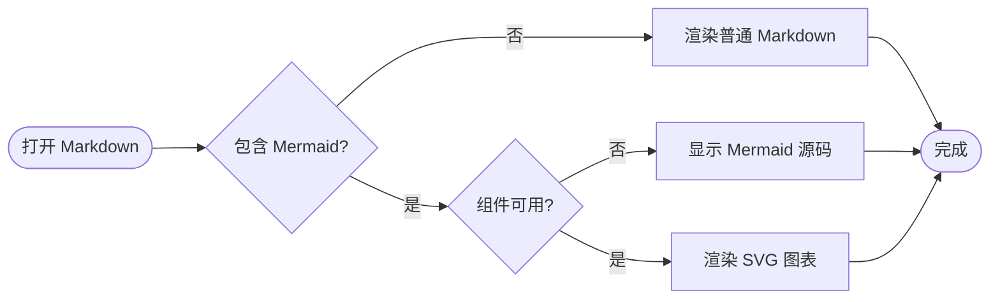
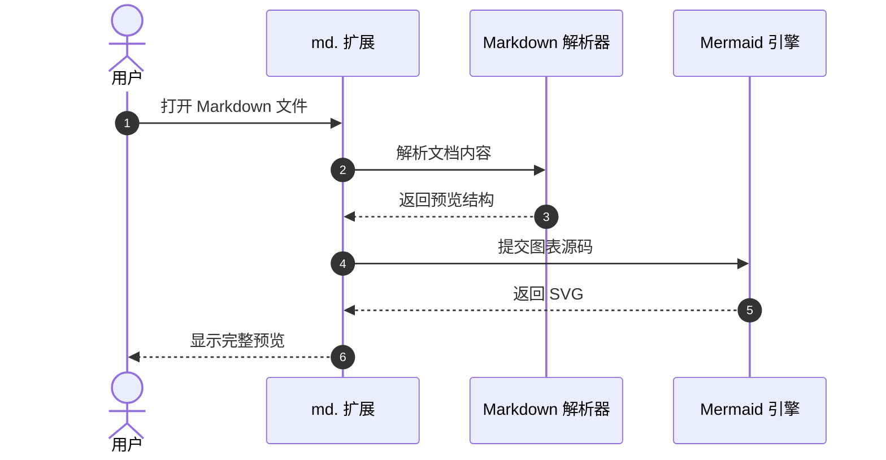
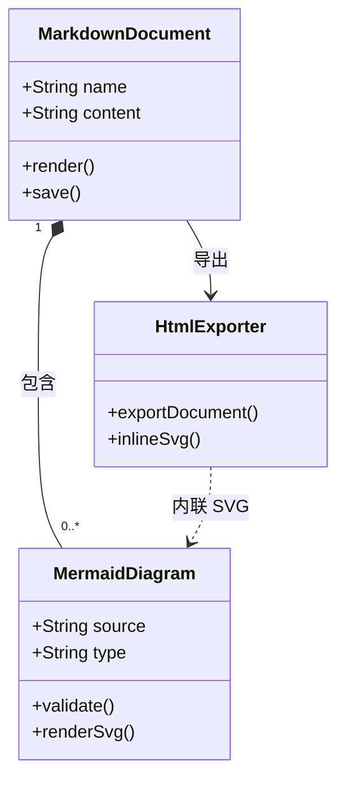
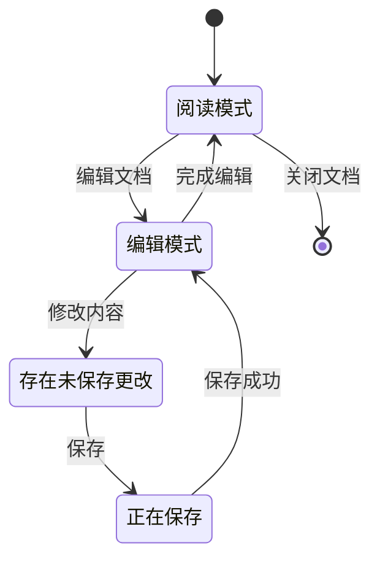
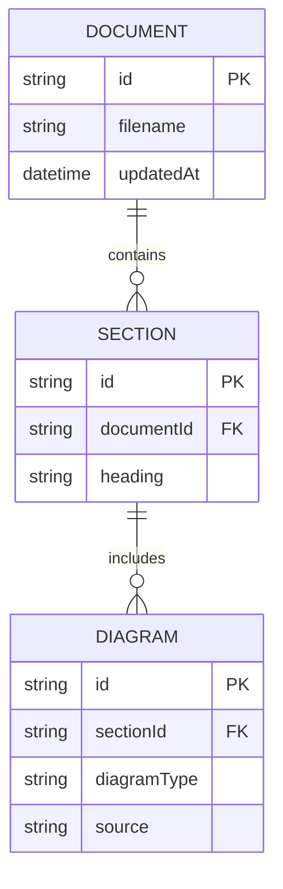
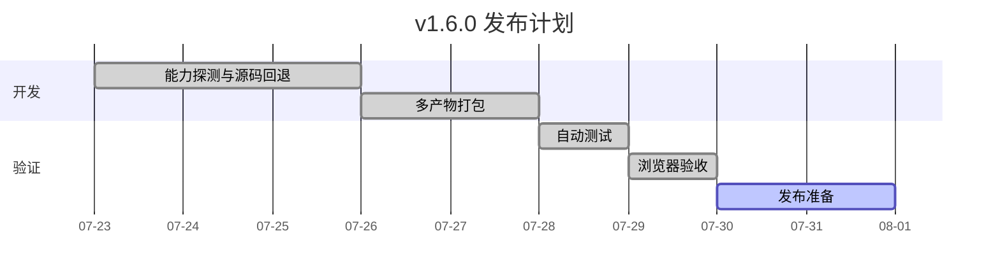
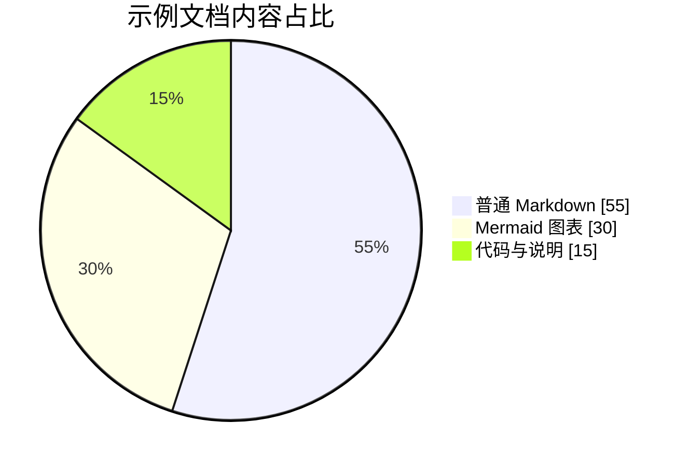
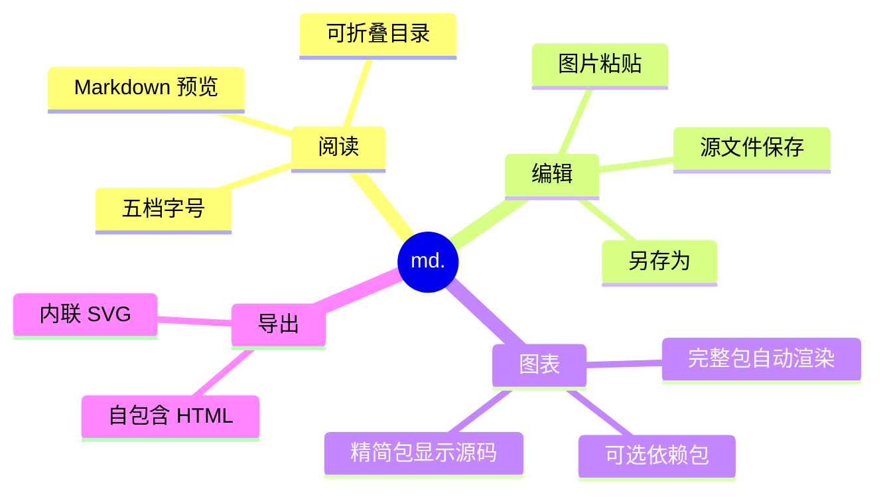

# Mermaid 主流图表示例

这份文档用于测试 md. v1.6.0 的 Mermaid 离线渲染能力。完整版应将以下代码块渲染为图表；精简版未安装 Mermaid 组件时应显示源码。

## 1. 流程图

适合表示业务流程、判断分支和处理步骤。

## 2. 时序图

适合表示多个参与者之间按时间顺序发生的交互。

## 3. 类图

适合描述系统中的类、属性、方法以及类之间的关系。

## 4. 状态图

适合表示一个对象在不同状态之间的转换。

## 5. ER 实体关系图

适合表示数据库实体、字段以及实体之间的关系。

## 6. 甘特图

适合表示项目计划、任务持续时间和先后依赖。

## 7. 饼图

适合表示各部分在整体中的占比。

## 8. 思维导图

适合表示主题拆解、知识结构和层级关系。

## 预期结果

- 完整包：以上 8 个 Mermaid 代码块均显示为 SVG 图表。
- 精简包：以上代码块显示源码，第一个代码块上方出现 Mermaid 组件安装入口。
- 安装依赖包后：重新加载扩展并刷新本文档，所有图表自动开始渲染。
