# Mermaid 类型回归夹具

## Mindmap

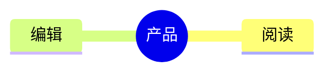

## Flowchart

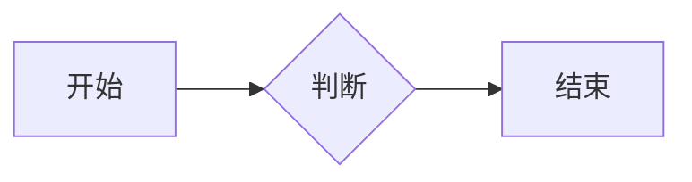

## Sequence

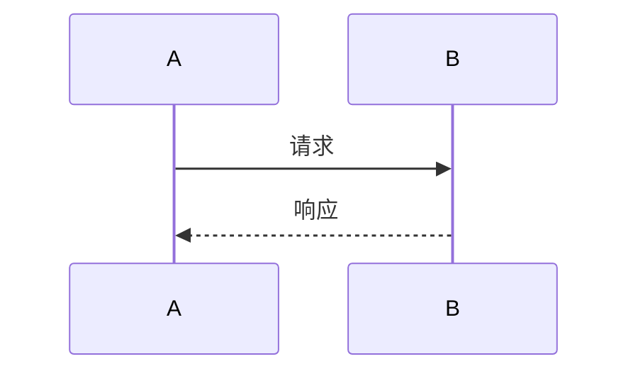

## Class

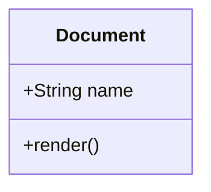

## State

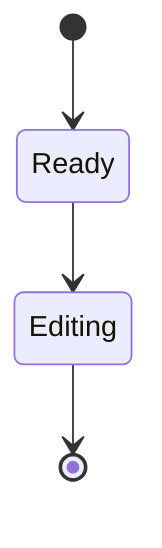

## ER

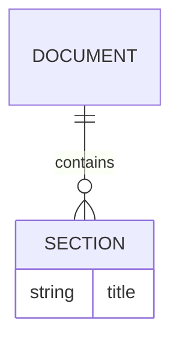

## Gantt

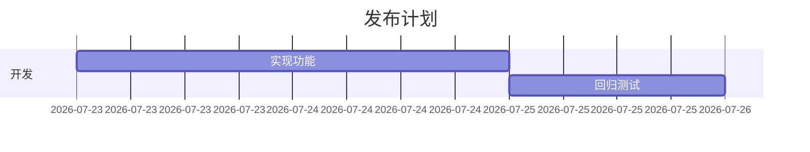

## Pie

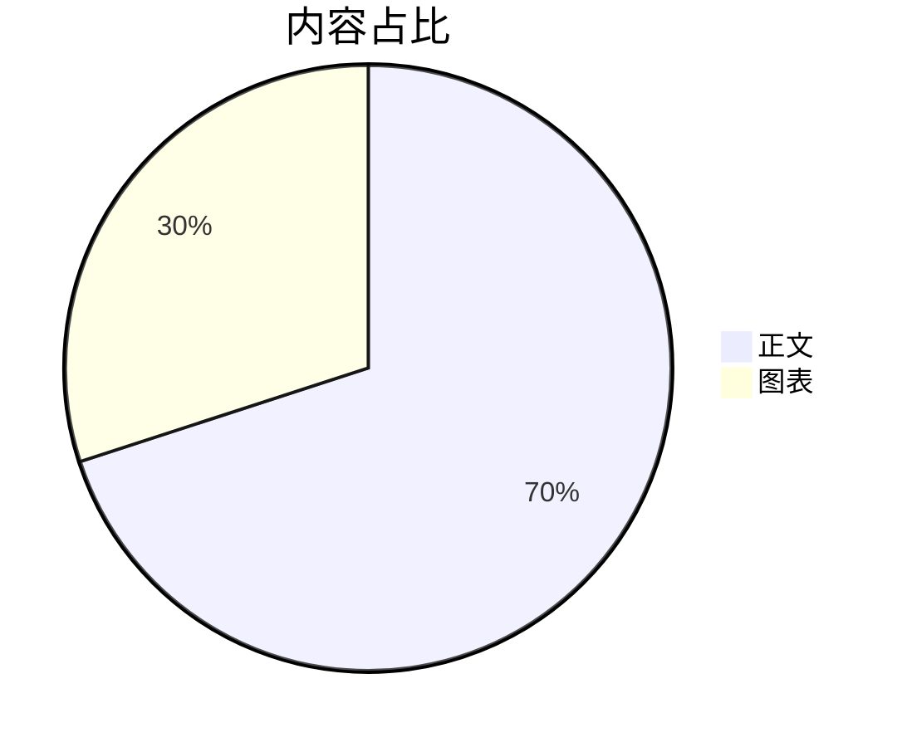

## Journey

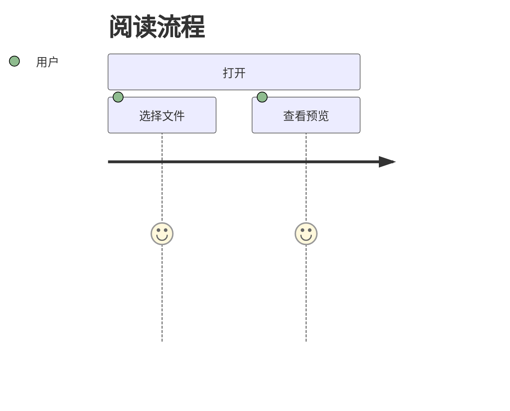

## Git Graph

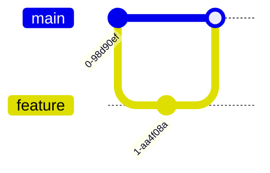

## Timeline

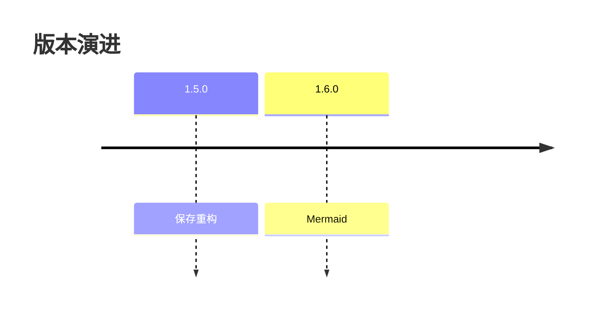

## Quadrant

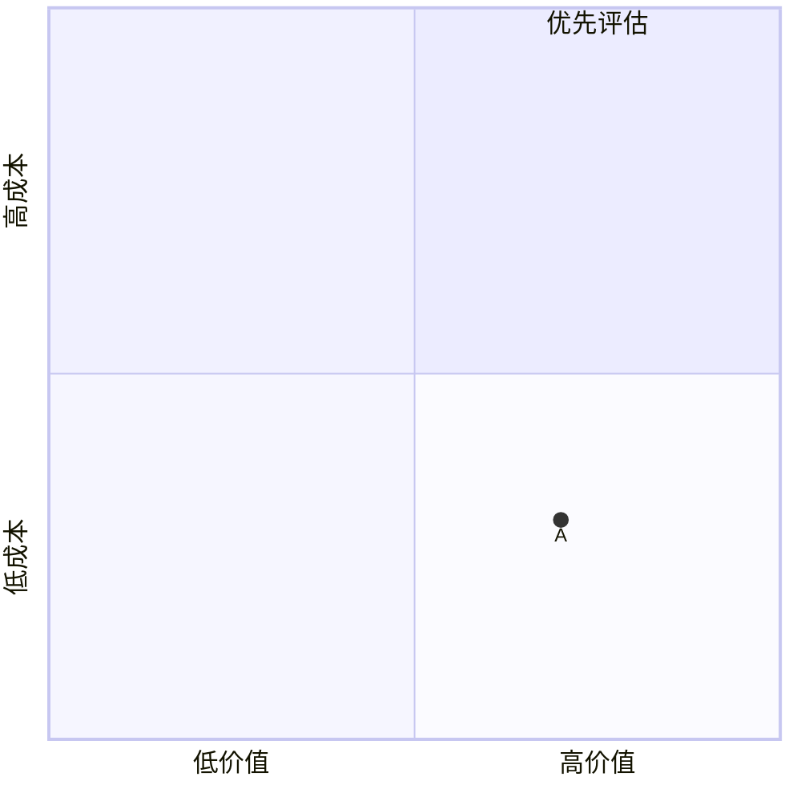

## XY Chart

```mermaid
xychart-beta
  title "趋势"
  x-axis [1, 2, 3]
  y-axis "数量" 0 --> 10
  line [2, 5, 8]
```

## Sankey

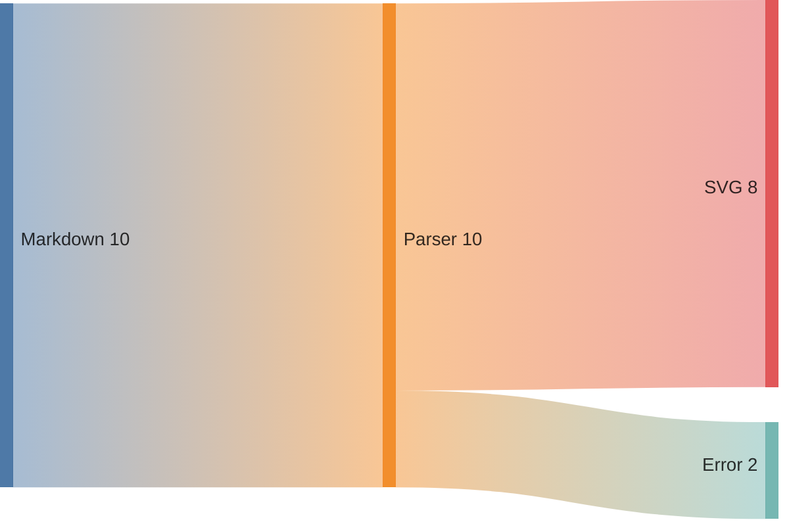

## Block

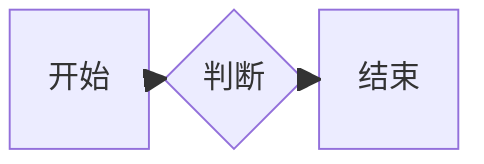

## Architecture

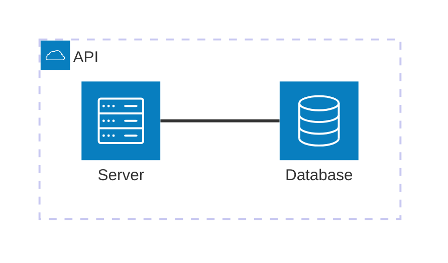

## 错误回退

```mermaid
notARealDiagram
  A --> B
```
