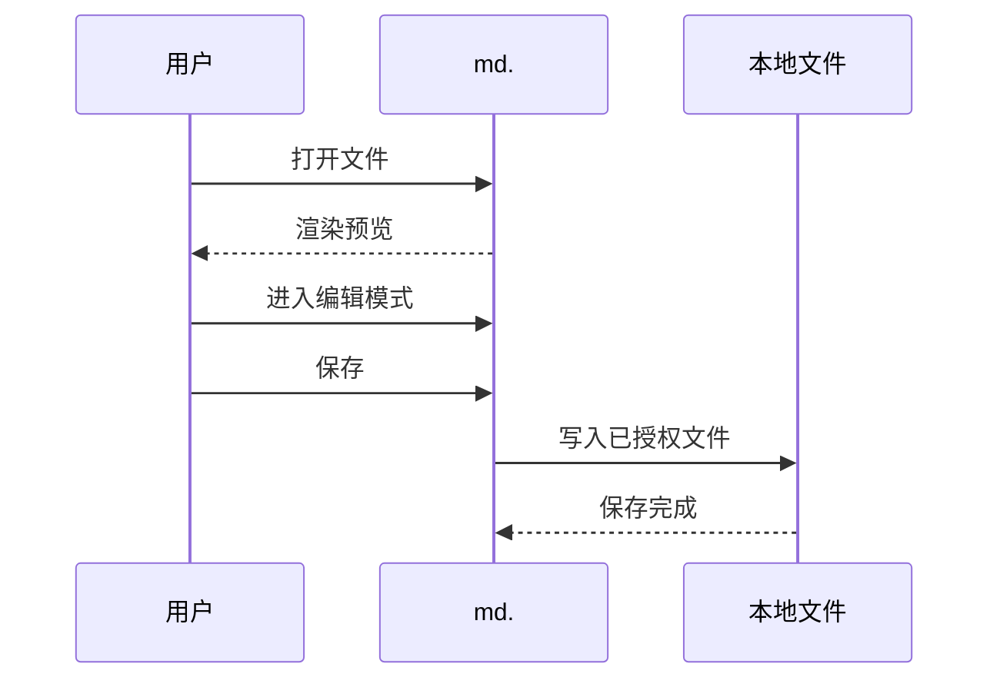

# v1.8.0 功能与回归验收文档

> 建议使用 v1.8.0 扩展打开本文件。先以阅读模式检查预览，再进入编辑模式完成复制、下载、保存和滚动测试。本文不依赖网络资源。

## 一、验收清单

### 1.8.0 新增功能

- [ ] 行内公式能够正确渲染
- [ ] 块级公式能够正确渲染且没有被截断
- [ ] 金额、转义美元符号和代码中的美元符号没有被误判为公式
- [ ] 错误公式显示原始内容，但不影响后续正文
- [ ] 普通代码块显示语言、复制和下载按钮
- [ ] 复制结果与代码块源码完全一致
- [ ] Python、JSON、Shell 和文本代码下载为正确扩展名
- [ ] 未知语言下载为 `.txt`
- [ ] Mermaid 图表不重复显示普通代码块工具栏
- [ ] HTML 导出保留公式和 Mermaid，不包含操作按钮
- [ ] 打印预览只包含文档内容，不包含侧栏、编辑区和操作按钮
- [ ] PDF 中的代码、表格、公式和宽图表没有横向截断
- [ ] PDF 正文可以选择、复制和搜索

### 既有功能回归

- [ ] 打开文件后默认只显示预览区
- [ ] 点击“编辑文档”后可显示编辑区
- [ ] 编辑区和预览区比例可拖动调整
- [ ] 编辑区或预览区可单独关闭和恢复
- [ ] 目录可折叠、展开并正确跳转
- [ ] 滚动正文时目录高亮同步变化并自动跟随
- [ ] 小、中、大字号均正常切换
- [ ] 浅色和深色主题下内容均清晰可读
- [ ] 编辑区与预览区滚动同步
- [ ] 任务列表和脚注正常渲染
- [ ] Mermaid 缩放及 SVG、PNG 下载正常
- [ ] 图片粘贴后编辑区显示短引用，预览区显示图片
- [ ] 标签页标题显示本文件名
- [ ] 保存、另存为和未保存提醒行为正常
- [ ] 本文件能够进入最近文件列表并重新打开

## 二、数学公式

### 公式标题 $E=mc^2$

目录中本标题应只出现一次公式文本，不应出现重复的公式内容。

常见行内公式：质能方程 $E=mc^2$，勾股定理 $a^2+b^2=c^2$，以及圆的面积 $S=\pi r^2$。

下面是独立块级公式：

$$
\int_0^1 x^2\,dx = \frac{1}{3}
$$

分式、根号、上下标和求和：

$$
\sum_{k=1}^{n} k = \frac{n(n+1)}{2},\qquad
x = \frac{-b \pm \sqrt{b^2-4ac}}{2a}
$$

矩阵：

$$
A = \begin{bmatrix}
1 & 2 & 3 \\
4 & 5 & 6 \\
7 & 8 & 9
\end{bmatrix}
$$

较宽公式用于检查横向显示和 PDF 适配：

$$
P(X_1,\ldots,X_n)=\prod_{i=1}^{n}P(X_i\mid X_1,\ldots,X_{i-1})
=P(X_1)P(X_2\mid X_1)\cdots P(X_n\mid X_1,\ldots,X_{n-1})
$$

### 不应渲染为公式的内容

- 商品原价 $100，优惠后 $80。
- 转义美元符号：\$100、\$200。
- 行内代码：`const price = "$100";`。
- 普通文本中的单个美元符号：预算约为 $500。

下面代码围栏中的美元符号应保持源码：

```text
$not_a_formula$
价格：$100
echo "$HOME"
```

### 错误公式回退

下一条公式故意包含不支持的命令，应以错误颜色显示，但“错误公式之后”章节必须继续正常渲染：

$\notARealCommand{x}$

#### 错误公式之后

如果能够看到这段文字、目录仍可点击、后面的 Mermaid 和代码块也能操作，说明单个公式错误没有中断整篇文档。

## 三、代码块复制与下载

### Python

预期下载文件名以 `-code-02.py` 结尾，因为前面的 `text` 围栏是本文第一个普通代码块。

```python
from dataclasses import dataclass


@dataclass
class Greeting:
    name: str

    def render(self) -> str:
        return f"你好，{self.name}！"


print(Greeting("Markdown").render())
```

复制后应保留中文、缩进和空行。

### JSON

预期下载扩展名为 `.json`，内容应保持合法 JSON。

```json
{
  "version": "1.8.0",
  "offline": true,
  "features": [
    "pdf",
    "code-tools",
    "katex",
    "mermaid"
  ],
  "message": "中文与 Unicode：✓"
}
```

### Shell

语言别名 `bash` 应下载为 `.sh`。

```bash
#!/usr/bin/env bash
set -euo pipefail

document="v1.8.0-acceptance-test.md"
printf 'Testing %s\n' "$document"
```

### 无语言标记

下面的代码围栏没有语言标记，应显示“纯文本”并下载为 `.txt`。

```
第一行：无语言代码块
第二行：保留中文
第三行：symbols !@#$%^&*()
```

### 未知语言

未知语言应保留语言标签，但下载扩展名回退为 `.txt`。

```internal-dsl
workflow Acceptance {
  input  = "Markdown"
  output = "Verified"
}
```

### 长代码行

预览区允许横向滚动，PDF 中应自动折行而不是截断右侧内容。

```javascript
const longLine = "ABCDEFGHIJKLMNOPQRSTUVWXYZ-abcdefghijklmnopqrstuvwxyz-0123456789-这是一段用于检查代码块横向滚动以及PDF打印自动折行行为的超长文本-ABCDEFGHIJKLMNOPQRSTUVWXYZ-abcdefghijklmnopqrstuvwxyz-0123456789";
console.log(longLine);
```

## 四、Mermaid 回归

### 流程图


图表上方应只显示 Mermaid 的缩放、SVG 和 PNG 工具，不应出现代码“复制/下载”工具。

### 时序图



### 宽流程图

此图用于检查预览区横向浏览和 PDF 纸张宽度适配。


## 五、Markdown 基础能力回归

### 文本样式

普通文字、**粗体文字**、*斜体文字*、~~删除线~~、`inline code` 和 [本地项目链接](https://github.com/primulaf/md-editor)。

> 这是引用块。浅色和深色模式下都应具有清晰的边界和足够的文字对比度。

---

### 列表

1. 有序列表第一项
2. 有序列表第二项
3. 有序列表第三项

- 无序列表一级
  - 无序列表二级
    - 无序列表三级

### 任务列表

- [x] 已完成任务
- [ ] 待处理任务
- [x] 复选框在预览区只读

### 表格

| 模块 | 预期结果 | 回归重点 |
|---|---|---|
| 目录 | 可折叠并正确跳转 | 长标题省略、自动跟随 |
| 编辑区 | 输入流畅 | 字号、滚动、图片短引用 |
| 预览区 | 内容与编辑区一致 | 公式、代码、Mermaid |
| HTML | 单文件离线打开 | 无操作工具栏 |
| PDF | 内容适配纸张 | 不截断宽内容 |

### 脚注

本工具的解析、公式和图表渲染均在本地完成[^offline]。HTML 导出也应保留脚注跳转与返回链接[^export]。

[^offline]: 断开网络后重新打开扩展，本文仍应正常渲染。
[^export]: 点击脚注编号跳到页尾，再点击返回符号回到正文。

### 原始 HTML

<details>
<summary>点击展开原始 HTML 内容</summary>

这段内容应能展开和收起，同时不能执行任何脚本。

</details>

## 六、目录、滚动与布局回归

### 一级定位段落

滚动到本节时，侧栏目录应自动高亮“一级定位段落”。如果条目在目录可视区域之外，目录本身应自动滚动到该条目。

#### 二级定位段落

点击目录中的本标题，预览区应立即跳转到这里；编辑模式下编辑区也应移动到大致对应位置。

##### 三级定位段落

收起“目录、滚动与布局回归”后，其子标题应隐藏；重新展开后恢复。

###### 六级标题测试

六级标题仍应进入正确的层级，不应造成目录换行或挤压布局。

### 用于滚动测试的正文 A

Markdown 阅读工具需要在长文档中保持目录、预览和编辑器的状态一致。滚动过程中不应出现目录高亮停留在旧标题、点击目录无反馈，或者编辑区和预览区显示不同文件内容的情况。

重复滚动本段附近，并在预览区与编辑区之间切换滚动来源。目录高亮应持续变化，不需要刷新页面恢复。

### 用于滚动测试的正文 B

调整编辑区与预览区比例到约 30:70、50:50 和 70:30。公式、代码块和 Mermaid 均应按照实际可用宽度重新布局，正文不能被固定最大宽度错误限制。

分别关闭编辑区和预览区，再恢复双栏。关闭一侧后另一侧应占据剩余空间，恢复时拖动比例功能仍可使用。

### 用于滚动测试的正文 C

依次切换小、中、大字号。侧栏、目录、统计信息、编辑区和预览区都应同步调整，代码工具按钮保持紧凑，文字不能溢出按钮。

切换深色主题后检查公式、代码高亮、Mermaid、表格、引用、滚动条和状态文字。再切回浅色主题，不能残留深色图表或代码样式。

## 七、图片与编辑回归

进入编辑模式，将一张图片粘贴到下面标记之间：

**图片粘贴区域开始**


**图片粘贴区域结束**

预期结果：

1. 编辑区只显示简短的 `md-image:` 引用，不显示大段 Base64。
2. 预览区在对应位置显示图片。
3. 目录点击、同步滚动和统计信息不受图片编码影响。
4. 复制包含图片的 Markdown 时恢复可移植 DataURL。
5. 保存或另存为后，磁盘文件包含完整图片数据。

## 八、保存、导出与文件状态

### 编辑测试标记

将下面的“待修改”改成“已修改”，观察标签页文件名前是否出现未保存标记：

`验收状态：待修改`

随后依次检查：

1. 使用工具栏“打开”选择本文件时，“保存”能够写回已授权文件。
2. 通过双击关联打开本文件时，首次保存会要求重新选择源文件。
3. “另存为”创建新 Markdown 文件，不覆盖当前源文件。
4. 有未保存更改时关闭标签页，Chrome 显示离开页面提醒。
5. HTML 导出不清除 Markdown 的未保存状态。
6. PDF 打印不清除 Markdown 的未保存状态。

## 九、HTML 与 PDF 输出检查

### HTML 导出

导出 HTML 后断开网络并打开文件，确认：

- 公式继续使用正确字体显示。
- Mermaid 以 SVG 显示。
- 代码保持高亮，但没有“复制”和“下载”按钮。
- Mermaid 没有缩放和下载工具栏。
- 任务列表、表格、脚注和中文均正常。

### PDF 打印

点击“更多文档操作”中的“打印 / 导出 PDF”，或按 `Ctrl/Cmd + P`，确认：

- 打印前显示文字层提示；勾选“以后不再提示”后，再次打印不重复显示。
- 打印窗口打开，在“目标打印机”中选择 Chrome 自带的“另存为 PDF”，不要选择“Microsoft Print to PDF”。
- PDF 固定为白底黑字，不受当前深色主题影响。
- 侧栏、编辑区、状态栏和按钮均未进入打印内容。
- 标题尽量与其后正文位于同一页。
- 表格、代码、公式、图片和 Mermaid 不被页面右侧截断。
- 多页内容顺序正确，没有空白首页或重复内容。
- 保存完成后打开 PDF，确认普通中英文正文可以选择、复制和搜索。

## 十、验收记录

| 项目 | 结果 | 备注 |
|---|---|---|
| 数学公式 | 待验收 |  |
| 代码复制 | 待验收 |  |
| 代码下载 | 待验收 |  |
| HTML 导出 | 待验收 |  |
| PDF 打印 | 待验收 |  |
| Mermaid | 待验收 |  |
| 目录与滚动 | 待验收 |  |
| 主题与字号 | 待验收 |  |
| 图片与保存 | 待验收 |  |

验收结论：**待填写**。
